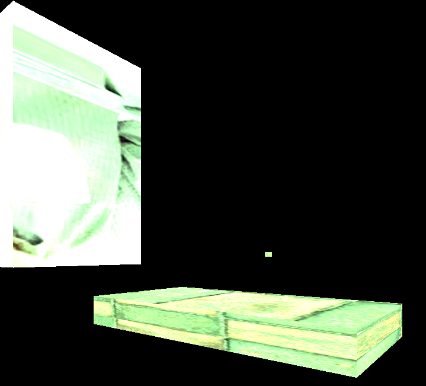

# **Projet Modern OpenGL** 

## **Introduction**

After do **OpenGl** project and a **Rasterizer** project we now use **ModernOpengl**. For the first time we have<br>
to use **Shaders** because in this project all the texture and mesh are claculate by **Shaders**.<br>
**!!!!you have to put your cursor inside the window to move the camera!!!***

### **Key to use :** 
To move the **Z axis** you have to use the **Up Arrow Key**  and **Down Arrow Key** .<br>
To move the **Y axis** you have to use the **A Key**  and **D Key** .<br>
To move the **X axis** you have to use the **W Key** and **S Key**       .<br>


### **Create gameObject:**
you can create a game object if you give inside the constructor the texture ,shader, and model you want to draw<br>
inside the while
```
	resource.Create(new Resources::Model, "cube", "Resources/Obj/cube.obj");
	resource.Create(new Resources::Model, "robot", "Resources/Obj/bender.obj");
	resource.Create(new Resources::Texture, "bender","Resources/Textures/bender.png");
	resource.Create(new Resources::Texture, "harold", "Resources/Textures/harold.jpg");
	resource.Create(new Resources::Texture, "wall", "Resources/Textures/wall.jpg");

	// Set Shader and link.
	shader.SetVertexShader("Resources/Shaders/vertexShaderSource.vert");
	shader.SetFragmentShader("Resources/Shaders/fragmentShaderSource.frag");
	shader.Link();

	// Create gameObject;
	GameObject robot(((Resources::Model*)resource.Get("robot")),&shader,((Resources::Texture*)resource.Get("bender")));
	GameObject cube1(((Resources::Model*)resource.Get("cube")), &shader, ((Resources::Texture*)resource.Get("harold")));
	GameObject cube2(((Resources::Model*)resource.Get("cube")),&shader, ((Resources::Texture*)resource.Get("wall")));
```
and you can draw like that in the while 
```
robot.mesh->Draw();
cube1.mesh->Draw();
cube2.mesh->Draw();
```

### **use light:**
tu use the light you can use the number of light you want to use <br>
**at the line : 139,140,141**
```
dirLights->activeLight = 0;
pointLights->activeLight = 1;
spotLights->activeLight = 0;
``` 
if you want to manipulate the light you have to use the number of the light inside the table like 
```
pointLights[0].position = camera.transform.position;
```
### **use transform:**
inside the gameObject you have the transform you can manipulate it like that 
```
cube1.transform.scale = Vector3D(0.5, 0.5, 0.5);
cube1.transform.rotation = rotationZ;
cube1.transform.position = Vector3D(2.0f, 0.0f, 0.0f);

cube2.transform.scale = Vector3D(3, 3, 3);
cube2.transform.rotation = rotationX;
cube2.transform.position = Vector3D(-7.0f, 0.0f, 0.0f);

robot.transform.position = Vector3D(0.0f, -0.5f, 0.0f);
robot.transform.rotation = rotationY;
```

### **Structure to apply :** 
.<br>


## **Etape** **1**  *: Debug*

To start this project we have to Create a Debug class we call to debug the motor the debug return some message inside the console. <br>
 

this class is inside the Core namespace i don t focus on it so the debug is not relly good. <br>


## **Etape** **2** *: Maths*
Inside the core we create a Maths namespace with all the fonction we need to build the project.<br>  

We need Vec2 ,Vec3 ,Vec4 and Matrix4D(i explain what we do with it after that point). 

## **Etape** **3**  *: Ressource*

This step is relly importante because all the thing we build in it have to be use to create the model Texture ect....<br>

so inside this class we have to create 
``` unordered_map<string, IResource*> ResourceManager::resourceMap;

//--------------Resource Manager------------\\

void ResourceManager::Create(IResource* resource, const std::string& name, const std::string& path)
{
	resource->Load(path);
	if (!resource)
	{
		return;
	}
	resourceMap.emplace(name, resource);
}

IResource* ResourceManager::Get(const string& name)
{
	if (resourceMap[name])
	{
		return resourceMap[name];
	}
}

void ResourceManager::Delete(const string& name)
{
	if (resourceMap[name])
	{
		resourceMap[name]->UnLoad();
	}
}

void ResourceManager::DeleteAll()
{
	resourceMap.clear();
}
```
## **Etape** **4** *: Model 3D (Parseur d’OBJ)*

in that step we have to read file and send all the information inside a list to read the value 

this file is composed by 3 type of prefix **V**  **VT**  **VN**  **F**.
```
v 1.000000 -1.000000 -1.000000
v 1.000000 -1.000000 1.000000
v -1.000000 -1.000000 1.000000
v -1.000000 -1.000000 -1.000000
v 1.000000 1.000000 -1.00000
v 1.000000 1.000000 1.000000
v -1.000000 1.000000 1.000000
v -1.000000 1.000000 -1.000000
vt 1.000000 0.333333
vt 1.000000 0.666667
vt 0.666667 0.666667
vt 0.666667 0.333333
vt 0.666667 0.000000
vt 0.000000 0.333333
vt 0.000000 0.000000
vt 0.333333 0.000000
vt 0.333333 1.000000
vt 0.000000 1.000000
vt 0.000000 0.666667
vt 0.333333 0.333333
vt 0.333333 0.666667
vt 1.000000 0.000000
vn 0.000000 -1.000000 0.000000
vn 0.000000 1.000000 0.000000
vn 1.000000 0.000000 0.000000
vn -0.000000 0.000000 1.000000
vn -1.000000 -0.000000 -0.000000
vn 0.000000 0.000000 -1.000000
f 2/1/1 3/2/1 4/3/1
f 8/1/2 7/4/2 6/5/2
f 5/6/3 6/7/3 2/8/3
f 6/8/4 7/5/4 3/4/4
f 3/9/5 7/10/5 8/11/5
f 1/12/6 4/13/6 8/11/6
f 1/4/1 2/1/1 4/3/1
f 5/14/2 8/1/2 6/5/2
f 1/12/3 5/6/3 2/8/3
f 2/12/4 6/8/4 3/4/4
f 4/13/5 3/9/5 8/11/5
f 5/6/6 1/12/6 8/11/6
```

we can use it to parse it. to build a result like that <br>


## **Etape ** **5**  *: Shader*
Its time to talk about shader at the start off the project all the vlue is inside the code on brut line <br> 
now we create 2 file one **.fra** and one **.vert** to send all the calcule to do inside 

but we have to init them and link them so i do 3 fonction 
```
bool SetVertexShader(const char* vertexPath);
bool SetFragmentShader(const char* fragmentShaderpath);
bool Link();
```
and put that on the **App::update**
```
	// Set Shader and link.
	shader.SetVertexShader("Resources/Shaders/vertexShaderSource.vert");
	shader.SetFragmentShader("Resources/Shaders/fragmentShaderSource.frag");
	shader.Link();
```
## **Etape** **6** *: Camera*

like the camera inside the **Rasterizer** the camera is easy to set but this time the shader <br>
calcule all the position so we have to send them the **mvp** to the shader 

i do that inside my mesh
```
	Matrix4D mvp;
	if (gameObject != nullptr)
	{
		mvp = Camera::GetProjection() * Camera::GetViewMatrix() * Matrix4D::CreateTransformMatrix(gameObject->transform);
		gameObject->UpdateSelfAndChild();
	}

	glUseProgram(shader->shaderProgram);
	if (material->texture != nullptr)
	{
		glBindTextureUnit(0, material->texture->textKey);
		glUniform1i(glGetUniformLocation(shader->shaderProgram, "texture1"), 0); // set it manually
	}

	glUniformMatrix4fv(glGetUniformLocation(shader->shaderProgram, "mvp"), 1, GL_FALSE, &mvp.e[0]);
	if (gameObject != nullptr)
		glUniformMatrix4fv(glGetUniformLocation(shader->shaderProgram, "modelMatrix"), 1, GL_FALSE, &gameObject->modelMatrix.e[0]);
```
## **Etape** **7** *: Light*
we have to do 3 type of light 

Type light :<br>
- Directional<br>
```
  vec3 CalcDirLight(DirLight light, vec3 normal, vec3 viewDir)
  {
    vec3 lightDir = normalize(-light.direction);
    // diffuse shading
    float diff = max(dot(normal, lightDir), 0.0);
    // specular shading
    vec3 reflectDir = reflect(-lightDir, normal);
    float spec = pow(max(dot(viewDir, reflectDir), 0.0), material.shininess);
    // combine results
    vec3 ambient = light.ambient * material.ambient;
    vec3 diffuse = light.diffuse * diff * material.diffuse;
    vec3 specular = light.specular * spec * material.specular;
    return (ambient + diffuse + specular) * dirIntensity;
  }
```
<br>


- Point<br>
```
  vec3 CalcPointLight(PointLight light, vec3 normal, vec3 fragPos, vec3 viewDir)
{
    vec3 lightDir = normalize(light.position - fragPos);
    // diffuse shading
    float diff = max(dot(normal, lightDir), 0.0);
    // specular shading
    vec3 reflectDir = reflect(-lightDir, normal);
    float spec = pow(max(dot(viewDir, reflectDir), 0.0), material.shininess);
    // attenuation
    float distance = length(light.position - fragPos);
    float attenuation = 1.0 / (light.constant + light.linear * distance +
        light.quadratic * (distance * distance));
    // combine results
    vec3 ambient = light.ambient * material.diffuse;
    vec3 diffuse = light.diffuse * diff * material.diffuse;
    vec3 specular = light.specular * spec * material.specular;
    ambient *= attenuation;
    diffuse *= attenuation;
    specular *= attenuation;
    return (ambient + diffuse + specular) * pointIntensity;
}
```
<br>

- Spot <br>
```
vec3  CalcSpotLight(SpotLight light, vec3 normal, vec3 viewDir)
{
   // Compute lighting parameters.
vec3  lightDir = normalize(light.position - fragPos);
float cutoff   = dot(lightDir, -1 * light.direction);

// Stop if the fragment isn't lit by the spot light.
if (cutoff < light.outerCutOff) 
    return (light.ambient + light.diffuse + light.specular) * spotIntensity;

// Continue light computations.
float diff        = max(dot(normal, lightDir), 0.0);
vec3  reflectDir  = reflect(lightDir, normal);
float spec        = pow(max(dot(-viewDir, reflectDir), 0.0), material.shininess);
float attenuation = clamp((cutoff - light.outerCutOff) / (light.innerCone - light.outerCutOff), 0.0, 1.0);
}

```
<br>

## **Etape** **7** *: Texture*

inside the load I apply the texture to a model and send it in my shader 
```
void Texture::Load(const std::string& name)
{
	int width, height, nrChannels;

	stbi_set_flip_vertically_on_load(true);
	unsigned char* data = stbi_load(name.c_str(), &width, &height, &nrChannels, 0);
	
	glGenTextures(1, &textKey);
	glBindTexture(GL_TEXTURE_2D, textKey);
	if(nrChannels == 3)
		glTexImage2D(GL_TEXTURE_2D, 0, GL_RGB, width, height, 0, GL_RGB, GL_UNSIGNED_BYTE, data);
	else
		glTexImage2D(GL_TEXTURE_2D, 0, GL_RGBA, width, height, 0, GL_RGBA, GL_UNSIGNED_BYTE, data);

	glGenerateMipmap(GL_TEXTURE_2D);

	stbi_image_free(data);
}
```


